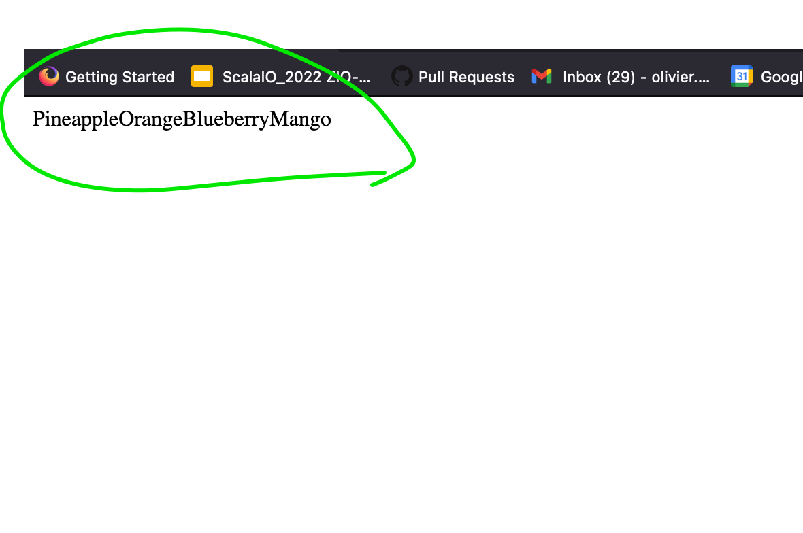
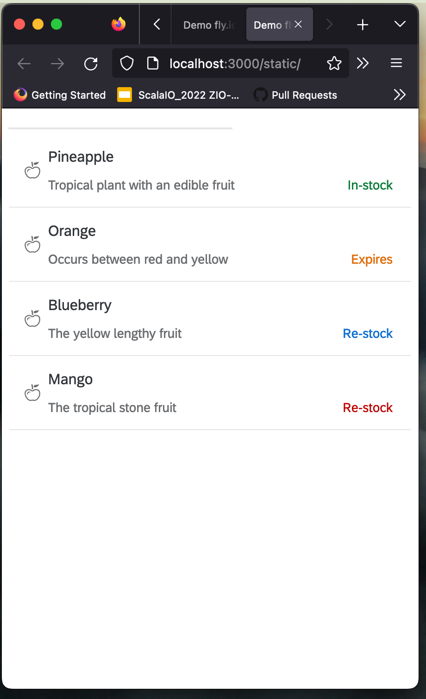

# Issue minimal sample

This is a minimal sample to reproduce an issue with the [issue]()

## Steps to reproduce

* Terminal 1

```bash
sbt "~fastLinkJS"
```

* Terminal 2

```bash
npm ci
npm run dev
```

* Open http://localhost:3000/static/

## Current behavior



## Expected behavior

By uncommenting the [line 15](./src/main/scala/entrypoint/EntryPoint.scala#L15) of the [EntryPoint.scala](./src/main/scala/entrypoint/EntryPoint.scala


